# Week 3: Post Synthesis GLS and STA Fundamentals
 
The focus of this week is to verify the functionality and timing of the VSDBabySoC design after synthesis. We begin by performing Gate-Level Simulation (GLS) to ensure that the synthesized netlist behaves identically to the RTL design. Next, we explore the fundamentals of Static Timing Analysis (STA), including setup and hold checks, timing paths, slack calculation, and clock-related considerations such as skew and jitter. The week also introduces the installation and use of OpenSTA to automate timing analysis and generate critical path reports. Finally, we generate timing diagrams to visualize signal propagation and slack across key paths. This week emphasizes the transition from functional correctness to timing-aware post-synthesis verification, highlighting the importance of validating both logic and timing in SoC design.

---

## 📜 Table of Contents
[📋 Prerequisites](#-prerequisites) <br>
[1. Gate-Level Simulation (GLS) of VSDBabySoC](#1-gate-level-simulation-gls-of-vsdbabysoc)<br>
[2. Fundamentals of Static Timing Analysis (STA)](#2-fundamentals-of-static-timing-analysis-sta)<br>
[3. Installation of OpenSTA and a Brief Introduction](#3-installation-of-opensta-and-a-brief-introduction)<br>
[4. Static Timing Analysis of VSDBabySoC](#4-static-timing-analysis-of-vsdbabysoc)<br>
[🏁 Final Remarks](#-final-remarks)

---

## 📋 Prerequisites
- Basic understanding of Verilog codes.
- Basic understanding of Linux commands.
- Successful installation of the tools shown in [Week 0.](https://github.com/BitopanBaishya/VSD-Tapeout-Program-2025---Week-0.git)
- Successful Pre-Synthesis Simulation of BabySoC in [Week 2.](https://github.com/BitopanBaishya/RISC-V-SoC-Tapeout-Program-2025---Week-2/blob/a1a81dd4416dbe5e51e05d8c87ce1f84db3291a2/README.md)

---

## 1. Gate-Level Simulation (GLS) of VSDBabySoC.
> [!TIP]
> Before diving into the Post-Synthesis Simulation of the VSDBabySoC, let’s first recall what synthesis and GLS mean in the SoC design flow.
> ### What is Synthesis?
> Synthesis is the process of converting the RTL (Register Transfer Level) description of a design — written in Verilog or VHDL — into a gate-level netlist. In simpler terms, it translates human-readable logic into a network of standard cells (like AND, OR, DFF, etc.) available in a specific technology library.<br>
> This step ensures that the design is now represented in a form that can actually be fabricated on silicon. The synthesis tool (like Yosys) optimizes the RTL logic to meet the required constraints such as area, power, and timing, and outputs a gate-level Verilog file (`netlist.v`) along with synthesis logs and reports.
> ### What is Gate-Level Simulation (GLS)?
> Once synthesis is done, we need to verify that the synthesized netlist still behaves the same way as the RTL description. This is done through Gate-Level Simulation (GLS).<br>
> GLS involves simulating the gate-level netlist (post-synthesis Verilog file) with the same testbench used for RTL simulation. This helps us confirm:
> * The logical functionality of the synthesized circuit matches the RTL.
> * The design is free from synthesis-induced issues like uninitialized nets, mismatched ports, or incorrect optimizations.
>
> To revise RTL Synthesis in detail, visit [here.](https://github.com/BitopanBaishya/RISC-V-SoC-Tapeout-Program-2025---Week-1/blob/39ab28880dd3ad3f48bbed38bf4fd0e14b621c49/Day%201/README.md#3-introduction-to-synthesis-netlist-yosys-and-frontend-libraries)
> To revise GLS in detail, visit [here.](https://github.com/BitopanBaishya/RISC-V-SoC-Tapeout-Program-2025---Week-1/blob/375e2128e691f2ef6fc6c438972b87ab7c131df6/Day%204/README.md)

### <ins>1. Synthesis of the Netlist.</ins>
1. **Step 1: Navigate to Module Directory & Launch Yosys**<br>
   Change the current directory to where the Verilog source files are located and start the Yosys synthesis tool.
   ```
   cd [path to your VSDBabySoC directory]/VSDBabySoC/src/module/
   yosys
   ```
   <div align="center">
     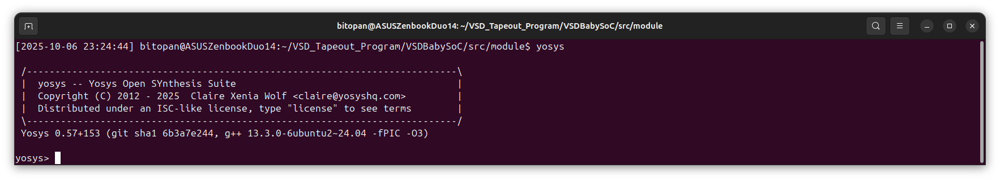
   </div>
2. **Step 2: Read Verilog Source Files**<br>
   Load the Verilog design files into Yosys for synthesis. The `-I` option specifies an additional include directory for any header or included files.
   ```
   read_verilog -I [path to your VSDBabySoC directory]/VSDBabySoC/src/include vsdbabysoc.v rvmyth.v clk_gate.v
   ```
   <div align="center">
     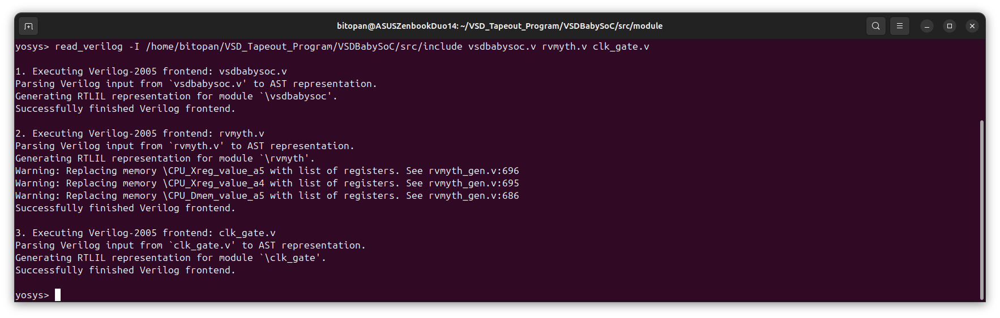
   </div>   
3. **Step 3: Load Standard Cell Libraries**<br>
   Import the Liberty format (`.lib`) timing and cell information files for the different modules and the target technology. These libraries provide Yosys with cell definitions, delays, and drive strengths for synthesis and mapping.
   ```
   read_liberty -lib [path to your VSDBabySoC directory]/VSDBabySoC/src/lib/avsdpll.lib
   read_liberty -lib [path to your VSDBabySoC directory]/VSDBabySoC/src/lib/avsddac.lib
   read_liberty -lib [path to your VSDBabySoC directory]/VSDBabySoC/src/lib/sky130_fd_sc_hd__tt_025C_1v80.lib
   ```
   <div align="center">
     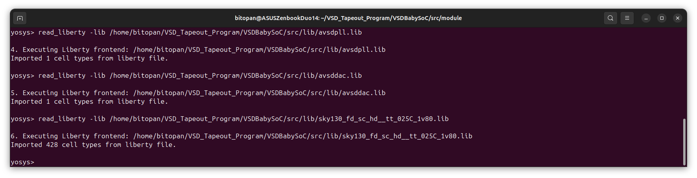
   </div>   
4. **Step 4: Synthesize Top Module**<br>
   Perform RTL-to-gate-level synthesis for the top-level module `vsdbabysoc`, converting Verilog code into a technology-independent gate-level representation.
   ```
   synth -top vsdbabysoc
   ```
   <div align="center">
     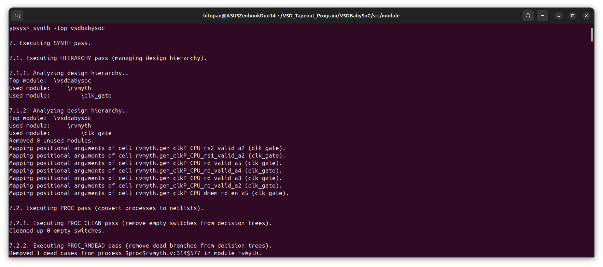
   </div>
   <div align="center">
     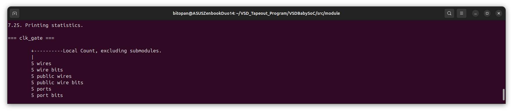
   </div>
   <div align="center">
     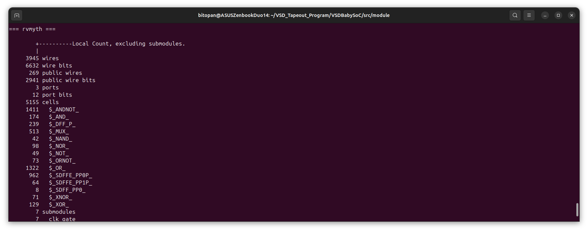
   </div>
   <div align="center">
     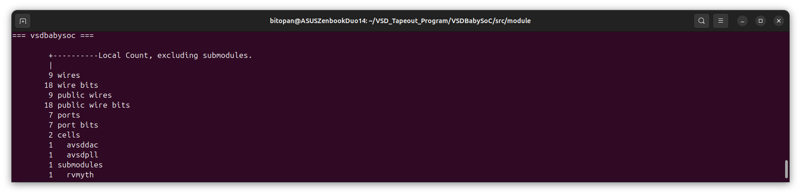
   </div>
   <div align="center">
     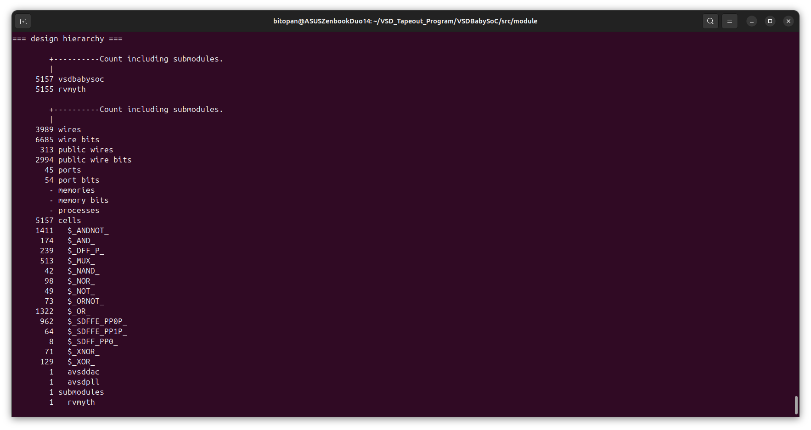
   </div>
5. **Step 5: Map Flip-Flops to Standard Cells**<br>
   Map all the D flip-flops in the design to the corresponding flip-flop cells from the provided standard cell library (`sky130_fd_sc_hd__tt_025C_1v80.lib`).
   ```
   dfflibmap -liberty [path to your VSDBabySoC directory]/VSDBabySoC/src/lib/sky130_fd_sc_hd__tt_025C_1v80.lib
   ```
   <div align="center">
     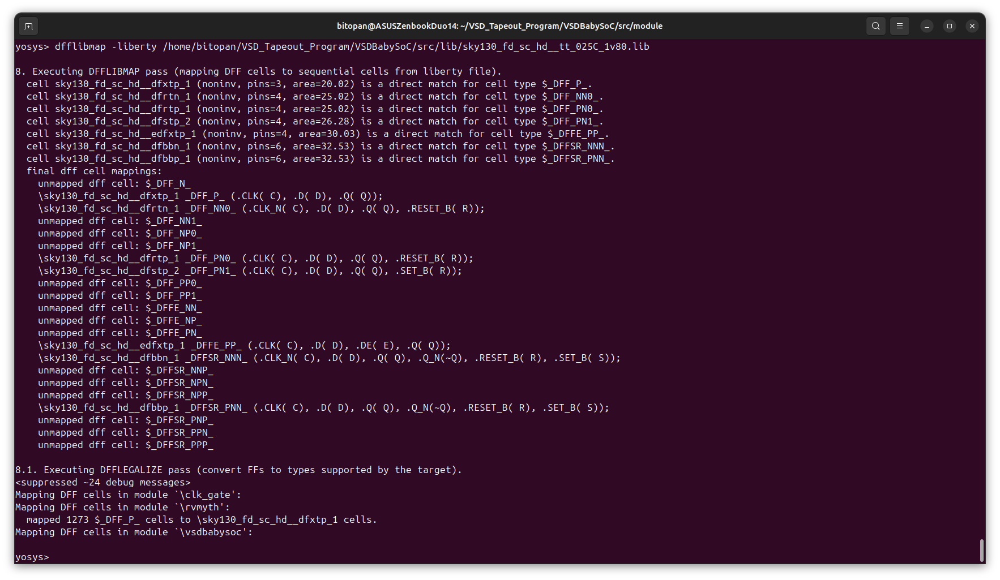
   </div>
6. **Step 6: Optimize the Design**<br>
   Perform general logic optimizations to simplify the circuit and reduce area, delay, and redundant logic.
   ```
   opt
   ```
   <div align="center">
     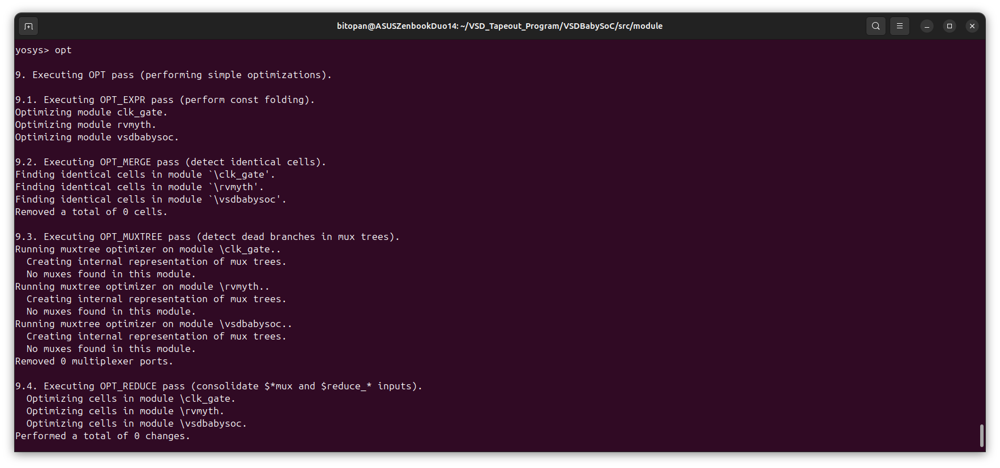
   </div>
   <div align="center">
     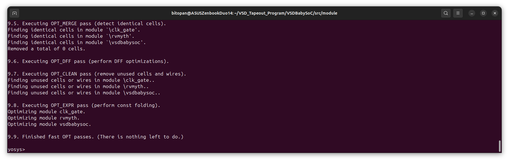
   </div>
7. **Step 7: Technology Mapping with ABC**<br>
   Run the ABC tool to map the synthesized design to the target standard-cell library, applying logic optimization, retiming, and decomposition steps to generate an efficient gate-level netlist.
   ```
   abc -liberty [path to your VSDBabySoC directory]/VSDBabySoC/src/lib/sky130_fd_sc_hd__tt_025C_1v80.lib -script +strash;scorr;ifraig;retime;{D};strash;dch,-f;map,-M,1,{D}
   ```
   <div align="center">
     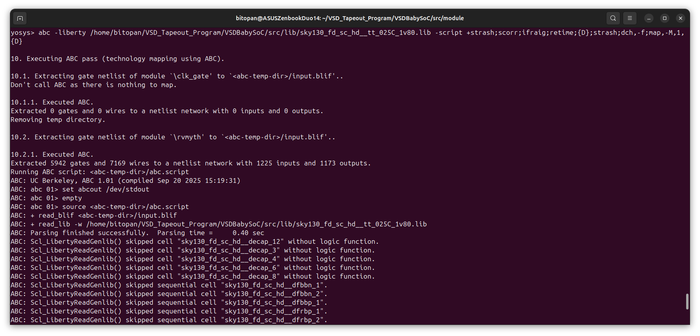
   </div>
   <div align="center">
     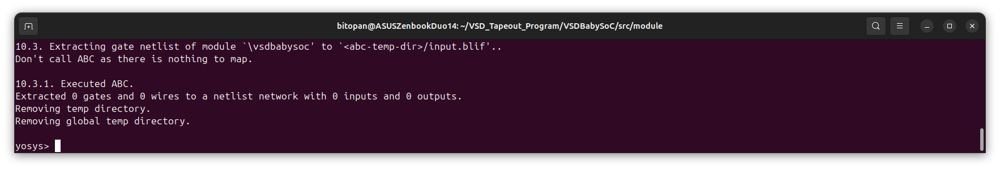
   </div>
8. **Step 8: Flatten the Design and Clean Up**<br>
   * `flatten`: Collapse all module hierarchies into a single top-level design.
   * `setundef -zero`: Set all undefined signals to logic 0.
   * `clean -purge`: Remove unused cells and nets.
   * `rename -enumerate`: Rename all remaining signals and cells systematically for clarity.
   ```
   flatten
   setundef -zero
   clean -purge
   rename -enumerate
   ```
   <div align="center">
     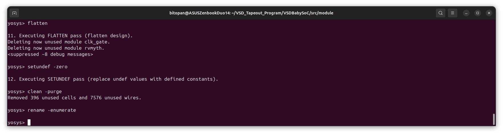
   </div>
9. **Step 9: Design Statistics**<br>
   Run the `stat` command to display a summary of the current design, including the number of cells, wires, and hierarchical modules, helping you assess the complexity and size of the synthesized netlist.
   ```
   stat
   ```
   <div align="center">
     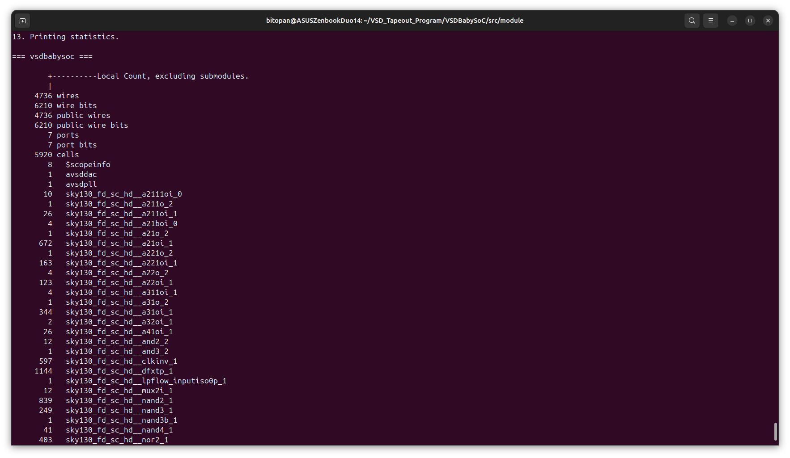
   </div>
   <div align="center">
     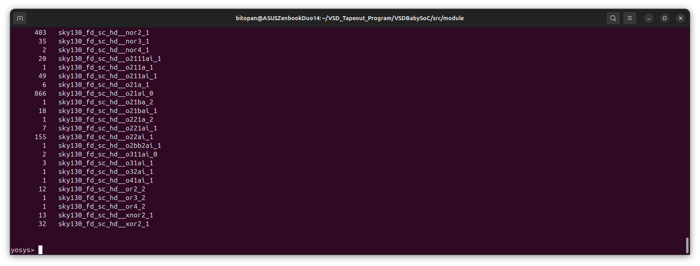
   </div>
10. **Step 10: Write Synthesized Netlist**<br>
   Use the `write_verilog` command to export the optimized gate-level netlist to a Verilog file, which can be used for post-synthesis simulations or further design analysis.
   ```
   write_verilog -noattr [path to your VSDBabySoC directory]/VSDBabySoC//output/post_synth_sim/vsdbabysoc.synth.v
   ```
   <div align="center">
     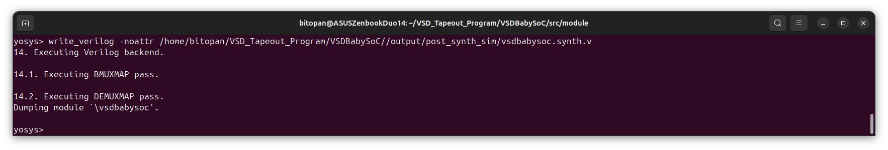
   </div>
   
11. **Step 11: Exit Yosys**<br>
   Terminate the Yosys synthesis session and return to the regular terminal shell.
   ```
   exit
   ``` 

### <ins>2. Gate-Level Simulation.</ins>
1. **Step 1: Compile Gate-Level Simulation**<br>
   Compile the gate-level netlist along with the testbench using Icarus Verilog, defining macros for post-synthesis simulation and functional behavior, and including necessary directories for source and GLS model files.
   ```
   iverilog -o [path to your VSDBabySoC directory]/VSDBabySoC/output/post_synth_sim/post_synth_sim.out -DPOST_SYNTH_SIM -DFUNCTIONAL -DUNIT_DELAY=#1 -I [path to your VSDBabySoC directory]/VSDBabySoC/src/include -I [path to your VSDBabySoC directory]/VSDBabySoC/src/module -I [path to your VSDBabySoC directory]/VSDBabySoC/src/gls_model -I [path to your VSDBabySoC directory]/VSDBabySoC/output/post_synth_sim [path to your VSDBabySoC directory]/VSDBabySoC/src/module/testbench.v
   ```
2. **Step 2: Navigate to Output Directory**<br>
   Change the current directory to the post-synthesis simulation output folder to access the compiled simulation files and results.
   ```
   cd [path to your VSDBabySoC directory]/VSDBabySoC/output/post_synth_sim/
   ```
3. **Step 3: Run Post-Synthesis Simulation**<br>
   Execute the compiled simulation binary to verify that the gate-level netlist produces the expected functional outputs.
   ```
   ./post_synth_sim.out
   ```
4. **Step 4: View Simulation Waveforms in GTKWave**<br>
   Open the generated VCD (Value Change Dump) file in GTKWave to visually inspect the signal transitions and verify the correctness of the post-synthesis simulation.
   ```
   gtkwave post_synth_sim.vcd
   ```
   <div align="center">
     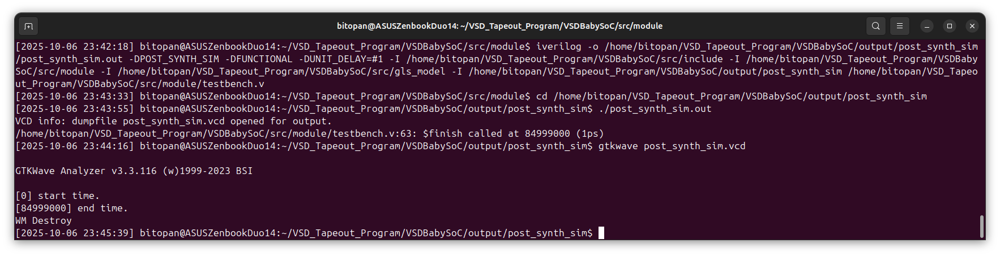
   </div>

### <ins>3. Output in GTKWave.</ins>
<div align="center">
  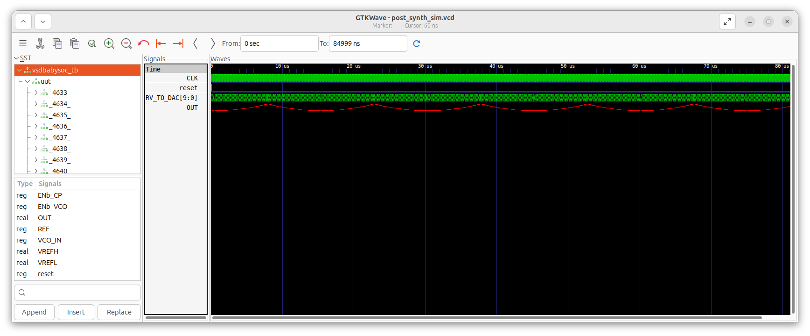
</div>

### <ins>4. The Synthesis Logs.</ins>
The screenshots of the synthesis logs, captured from the terminal, are provided under each corresponding command. These screenshots display the username and timestamps for reference. Note that timestamps could not be captured while running Yosys, as it does not natively support this feature; however, timestamps are visible outside the Yosys environment.<br>
For certain commands, the logs could not be displayed in full within the screenshots due to their extensive length. In these cases, only the beginning and end portions of the command outputs are shown. For those interested in reviewing the complete synthesis logs, the entire terminal output has been exported as a log file, which can be accessed [here.](VSDBabySoC_GLS_Bitopan.log)

### <ins>5. Analysis after GLS.</ins>
After completing both the RTL simulations and gate-level simulations (GLS) of the VSDBabySoC design, a comparison of the outputs was performed using GTKWave. The key observations are as follows:
1. **Functional Equivalence:**
   The outputs of the gate-level simulation exactly match the outputs from the RTL simulation, confirming that the synthesis and subsequent technology mapping have preserved the intended functionality of the design.
2. **Timing and Signal Integrity:**
   No unexpected glitches or incorrect transitions were observed in the GLS outputs. All signals behaved as expected under the defined testbench stimuli, indicating that the design is stable and timing-correct at the synthesized level.
3. **Conclusion:**
   The successful verification of GLS against RTL simulations validates that the synthesized netlist is functionally equivalent to the RTL design. This confirms the correctness of the synthesis flow, cell mapping, and the overall implementation of the VSDBabySoC.

---

## 2. Fundamentals of Static Timing Analysis (STA).
### <ins>1. What is Static Timing Analysis?</ins>
Static Timing Analysis (STA) is a method used in digital design to verify that a circuit meets its timing requirements without simulating actual waveforms. It calculates the expected signal arrival and checks if it meets setup, hold, and other timing constraints.<br>
*Think of STA as “predictive timing verification”—you aren’t simulating waveforms but calculating if the timing rules are satisfied.*

### <ins>2. Core Components of STA</ins>
STA broadly comprises three main components:
- **Timing Checks**:<br>
  These are the first level of diagnosis for a chip, ensuring signals meet timing rules. Examples include:
  * **Setup checks**: Verify signals arrive before the clock edge.
  * **Hold checks**: Ensure signals are stable after the clock edge.
  * **Recovery/Removal checks**: For asynchronous signals like resets.

- **Constraints**:<br>
  Constraints are specifications provided to the STA tool, defining timing requirements for clocks, inputs, outputs, and internal paths.

- **Libraries**:<br>
  Libraries provide the models used in STA. These models define the behavior of standard cells (gates, flip-flops, etc.) under different conditions. Models can be Non-Linear Delay Models (NLDM) or constant current source models
  
### <ins>3. Timing Path</ins>
A timing path is the route that a signal takes from its starting point to its endpoint in a digital circuit.
- **Start point:** Clock pin of a flip-flop or an input port
- **End point:** D pin of a flip-flop or an output port

It is crucial to identify valid timing paths so that STA checks are meaningful.

### <ins>4. Key Timing Parameters</ins>
- **Arrival Time**:<br>
  * The time taken for a signal to travel from the start point to the endpoint.
  * Calculated only at the endpoints of the timing path.
- **Launch Flop and Capture Flop**:<br>
  * **Launch flop**: The flip-flop from which a signal is launched.
  * **Capture flop**: The flip-flop that captures the signal.
- **Required Time**:<br>
  * Defines when a signal is expected to arrive at the endpoint.
  * Example: A signal should arrive after 0.5 ns but before 3 ns.
    * 0.5 ns → minimum expected time
    * 3 ns → maximum expected time
- **Slack**:<br>
Slack is the difference between the arrival time and the required time. It indicates timing margin.
  * Minimum Slack: `arrival time – min required time` → Hold Slack
  * Maximum Slack: `max required time – arrival time` → Setup Slack

### <ins>5. Types of Timing Analysis</ins>
- **Setup/Hold Analysis**
  * **Reg2Reg**: From a register to another register
  * **In2Reg**: From an input port to a flop’s D pin
  * **Reg2Out**: From a flop’s Q pin to an output port
  * **In2Out**: From an input port to an output port

    The last three categories are collectively called I/O timing.
- **Other Timing Checks**
  * **Clock-Gating Analysis**: From clock to gate output
  * **Recovery/Removal Analysis**: From clock to reset of another flip-flop
  * **Data-to-Data Check**: Ensures two signals remain in synchronism
  * **Latch Analysis**: Time borrowing between latches and flops

- **Slew / Transition Analysis**
  * Ensures the rise/fall times of signals are within minimum and maximum limits.
  * Subdivisions:
    * Data slew analysis
    * Clock slew analysis
  * Important for power and signal integrity considerations.

- **Load Analysis**
  * **Fanout analysis**: Ensures maximum/minimum fanout limits are not violated.
  * **Capacitance analysis**: Checks that node capacitances are within acceptable limits.
 
- **Clock Analysis**
  * Skew Analysis:
    * Skew = difference in latency from the clock input to each flip-flop clock port
    * Skew must be managed as it affects setup and hold margins.
  * Pulse Width Analysis: Checks the degradation of pulse width through the circuit.

### <ins>6. Setup Analysis with a Single Clock</ins>
- **Delays in the Circuit**:<br>
  In STA, all components and wires have delays, measured in nanoseconds (ns) or picoseconds (ps), depending on the technology:
  * **Cell delays**:<br>
    Denoted like `a(2)`, meaning element `a` has 2 units of delay.
  * **Wire delays**:<br>
    Example: `0.1`, `0.2`, `0.15` units, depending on the wire length and resistance.
  * **Signal transition delays**:<br>
    When a signal arrives at an input pin, its rise/fall transition times also contribute to the total delay.

  All these delays add up along the timing path and affect the final arrival time of signals.
- **Timing Graph / DAG**:<br>
  To analyze timing efficiently, we represent the circuit as a Directed Acyclic Graph (DAG), also called a timing graph:
  * **Nodes:** represent points in the circuit (pins or cells, depending on convention)
  * **Edges:** represent signal propagation delays

  This graph allows the STA tool to systematically calculate timing parameters across the entire design.
- **Actual Arrival Time (AAT)**:<br>
  * **Definition**: Time at any node when the latest transition occurs after the first clock edge.
  * **Calculation:**
    * Sum of all previous delays from the source to that particular node.
    * For multi-input nodes:
      * Setup analysis: take the largest AAT (worst-case delay)
      * Hold analysis: take the smallest AAT (earliest arrival)

  Intuition: For setup checks, we care about signals that arrive late, while for hold checks, we care about signals that arrive too early.
- **Required Arrival Time (RAT)**:<br>
  * **Definition**: Time at any node when a signal is expected to arrive to meet timing requirements.
  * **Calculation:**
    1. Start at the output pin where the required timing is defined.
    2. Work backwards, subtracting delays along each edge to calculate RAT for each upstream node.
    3. For multi-output nodes: take the smallest RAT, as it represents the most restrictive timing requirement.

   *Think of AAT as “what actually happens” and RAT as “what should happen”.*

- **Slack Computation**:<br>
  Slack indicates whether a design meets timing requirements:
  * **Calculation**: `Slack=RAT−AAT`
  * **Positive slack**: timing requirement satisfied
  * **Negative slack**: timing violation
    * When slack is negative at outputs, we can trace back through the graph to identify the nodes causing the largest negative slack.
    * Tuning the delays of these nodes improves overall timing.

  *Slack is your signal health indicator—negative slack highlights trouble spots.*

- **Graph-Based vs Path-Based Analysis**:<br>
  STA can be performed in two approaches:
  1. Graph-Based Analysis (Node-based):
     * DAG is represented using pin-node convention: each pin of a cell is a node, and the cell itself disappears.
     * AAT, RAT, and slack are computed at every node, giving a detailed view of timing across the circuit.
  2. Path-Based Analysis:
     * Focuses only on specific timing paths, from launch to capture points.
     * Easier for high-level timing checks but less detailed than node-based graph analysis.

     Graph-based analysis is considered more accurate and detailed, especially for complex designs.

### <ins>7. Flip-Flop Timing, Clock Skew, and Jitter</ins>
- **Launch-to-Capture Timing**:<br>
  For correct operation of a circuit: Delay from CLK of launch flop to D pin of capture flop, `θ < T`
  * T = clock period
  * Ensures the signal launched by one flip-flop reaches the capture flop before the next clock edge.

- **Flip-Flops as “Rooms with Doors”**:<br>
  * Imagine each flip-flop as a room with a door.
  * The door opens and closes with the clock edge, allowing data to flow only when open.
  * Timing constraints ensure the data arrives while the door is open, preventing errors.

- **Clock Network Delays and Skew**:<br>
  * The clock edge can be delayed by buffers in the clock network.
  * These delays are called:
    * Launch clock network delay (`Δ1`)
    * Capture clock network delay (`Δ2`)
  * Updated timing equation: `θ+Δ1​ < T+Δ2​`
  * Clock Skew (`Δ1 − Δ2`): Difference in arrival times of the clock at launch and capture flip-flops. Skew affects setup and hold margins.

- **Flip-Flop Internal Structure**:<br>
  * Flip-flops are made of negative and positive latches in series.
  * Transmission gates (Tr) control data flow between latches:
    * Negative latch: Active when CLK is low; Tr1 ON → latches input `D` to intermediate `Qm`.
    * Positive latch: Active when CLK is high; Tr4 ON → latches `Qm` to final output `Q`.
  * Finite propagation time exists from `D → Qm → Q`.

- **Setup Time**:<br>
  * **Definition**: Minimum time before the clock edge that the input D must remain stable so the flip-flop captures data reliably.
  * Calculation (from the given example): Setup Time=3 inverter delays+1 transmission gate delay
  * Ensures that `Qm` reliably reflects the input `D` at the clock edge.

- **Hold Time**:<br>
  * **Definition**: Minimum time after the clock edge that `D` must remain stable.
  * In the example flip-flop:
    * After rising CLK edge, Tr1 turns OFF → input `D` can change immediately
    * Hold time = `0` (in this simplified example)

- **CLK-to-Q Delay**:<br>
  * **Definition**: Time from the clock edge to when the output `Q` becomes valid.
  * From the example: CLK-to-Q delay=1 transmission gate delay+1 inverter delay

- **Realistic Setup Equation**:<br>
  * Accounting for flip-flop setup time at the capture flop: `θ+Δ1​ < T+Δ2​−S`
  * S = setup time of capture flip-flop
  
- **Clock Jitter and Uncertainty**:<br>
  * **Clock jitter**: Temporary variations in clock period due to voltage droop, ground bounce, or other noise.
  * **Noise margin**: Range of acceptable signal distortion; logic levels are still correctly interpreted.
  * Jitter affects data required time, so we include uncertainty (SU) in timing analysis: `θ+Δ1​ < T+Δ2​−S−SU`
  * LHS: Data Arrival Time (DAT)
  * RHS: Data Required Time (DRT)
  * Slack= DRT − DAT
  * Positive slack → design meets timing
  * Negative slack → timing violation; requires adjustment

### <ins>8. Graphical-to-Textual Representation</ins>
In STA, analysis results are often represented in two complementary forms:
- **Graphical Representation**:<br>
  * Shown as a timing graph (DAG), where each node represents a pin and each edge represents a delay.
  * Helps visualize how delays accumulate from clock to data paths.
- **Textual Representation**:<br>
  * STA tools (like OpenSTA) display delays in text form, showing each cell, net, and transition along the timing path.
  * In the example below:
    * b1/a → net delay
    * b1/y → cell delay

### <ins>9. Hold Analysis</ins>
While setup analysis ensures data arrives on time, hold analysis ensures data doesn’t arrive too early after a clock edge.<br>
Key Concept:
- Setup analysis depends on the capture flop (data must arrive before its clock edge).
- Hold analysis depends on the launch flop (data must not arrive too soon after launching).
- The basic hold timing rule is: `θ > H`, where:
  * θ (theta) = data arrival time from the launch clock
  * H = hold time (minimum time the data must remain stable after the clock edge)

*In simple terms: after a clock edge, the flip-flop’s door just closed — give it a moment before knocking again!*
 
- Slack Calculation for Hold Analysis<br>
Unlike setup analysis, in hold analysis the slack equation reverses: `Slack = Data Arrival Time − Data Required Time`
  * Positive Slack → No hold violation
  * Negative Slack → Hold violation (data arrived too early)

- Slack Calculation for Hold Analysis<br>
Unlike setup analysis, in hold analysis the slack equation reverses: `Slack = Data Arrival Time − Data Required Time`
  * Positive Slack → No hold violation
  * Negative Slack → Hold violation (data arrived too early)

- Hold Uncertainty<br>
Hold uncertainty is much lower than setup uncertainty. Here's why:
  * Setup uncertainty accounts for clock period variations over multiple cycles — jitter, phase drift, voltage/temperature effects, etc. Hold uncertainty, however, only matters within the same clock edge, where such variations are minimal. Hence, hold uncertainty values are smaller, since hold analysis deals with instantaneous stability, not cycle-to-cycle shifts.

    *Think of setup checks as “long-distance timing,” while hold checks are “short-distance sprints.” The longer the journey, the more uncertainty piles up.*

- Graphical-to-Textual Conversion for Hold Analysis<br>
  The conversion process is the same as for setup analysis.
  * You use the same commands or tool flow in OpenSTA (or any STA tool).
  * Only the direction of timing propagation and the definition of slack differ.

---

## 3. Installation of OpenSTA and a Brief Introduction.

### <ins>1. Installation of OpenSTA</ins>
The following Github Repo was referred for the detailed documentation during the installation of OpenSTA: [spatha_vsd-hdp](https://github.com/spatha0011/spatha_vsd-hdp/blob/0ee1c5464d5af4c125520b4ede73b4848309869e/Day7/README.md#installation-of-opensta).
- **Step 1**:<br>
  Clone the github Repository.
  ```
  git clone https://github.com/parallaxsw/OpenSTA.git
  cd OpenSTA
  ```

- **Step 2**:<br>
  Build the Docker Image.
  ```
  docker build --file Dockerfile.ubuntu22.04 --tag opensta
  ```

- **Step 3**:<br>
  Run the OpenSTA container.
  ```
  docker run -i -v $HOME:/data opensta
  ```

- **Step 4**:<br>
  Run the OpenSTA container.
  ```
  docker run -i -v $HOME:/data opensta
  ```

  This will take you inside the container, with a `%` symbol, and OpenSTA will be ready to use.

### <ins>2. Static Timing Analysis of an example file.</ins>
Here we will first perform Static Timing Analysis of an example file `example1.v` to learn how to perform STA inside OpenSTA. After this, we will proceed to perform STA of VSDBabySoC.<br>

- First initiate OpenSTA. After entering the OpenSTA shell (indicated by the `%` prompt), you can run a simple static timing analysis using the following inline commands:
  ```
  # Instructs OpenSTA to read and load the Liberty file "nangate45_slow.lib.gz".
  read_liberty /OpenSTA/examples/nangate45_slow.lib.gz

  # Intructs OpenSTA to read and load the Verilog file (gate level verilog netlist) "example1.v"
  read_verilog /OpenSTA/examples/example1.v

  # Using "top," which stands for the main module, links the Verilog code with the Liberty timing cells.
  link_design top

  # Create a 10ns clock named 'clk' for clk1, clk2, and clk3 inputs 
  create_clock -name clk -period 10 {clk1 clk2 clk3}

  # Set 0ns input delay for inputs in1 and in2 relative to clock 'clk'
  set_input_delay -clock clk 0 {in1 in2}

  # Report of the timing checks for the design 
  report_checks 
  ```

  Output:
  <div align="center">
     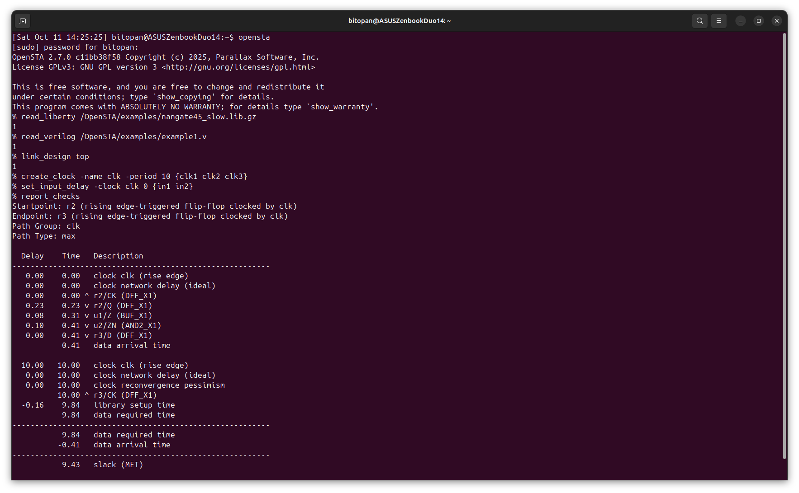
  </div>

- The `report_checks` command is used in this case because only the slow Liberty file (`nangate45_slow.lib.gz`) has been loaded. This corresponds to a setup (maximum delay) corner, meaning the analysis is inherently focused on setup timing.
- Why does `report_checks` display only maximum (setup) paths?<br>
  By default, the `report_checks` command reports paths with maximum delay, equivalent to executing:
  ```
  report_checks -path_delay max
  ```
- To specifically analyze hold checks (minimum path delays), the command should be:
  ```
  report_checks -path_delay min
  ```

  Then the output would be:
  <div align="center">
     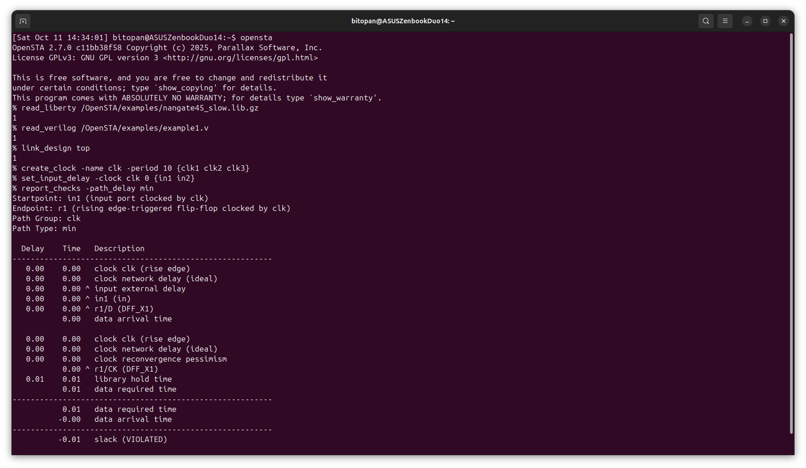
  </div>  

- **SPEF-Based Timing Analysis**<br>
  The following OpenSTA timing analysis flow incorporates SPEF-based parasitic modeling, which enhances the accuracy of timing results by including post-layout parasitic effects.<br>
  By integrating SPEF (Standard Parasitic Exchange Format) data, OpenSTA accounts for real-world resistive (R) and capacitive (C) interconnect delays extracted from the layout. This leads to a more realistic computation of path delays and timing slacks, thereby improving the precision and reliability of final timing signoff.<br>
  Run the following commands inside OpenSTA:
  ```
  read_liberty /OpenSTA/examples/nangate45_slow.lib.gz
  read_verilog /OpenSTA/examples/example1.v
  link_design top
  read_spef /OpenSTA/examples/example1.dspef
  create_clock -name clk -period 10 {clk1 clk2 clk3}
  set_input_delay -clock clk 0 {in1 in2}
  report_checks
  ```

  Output:
  <div align="center">
     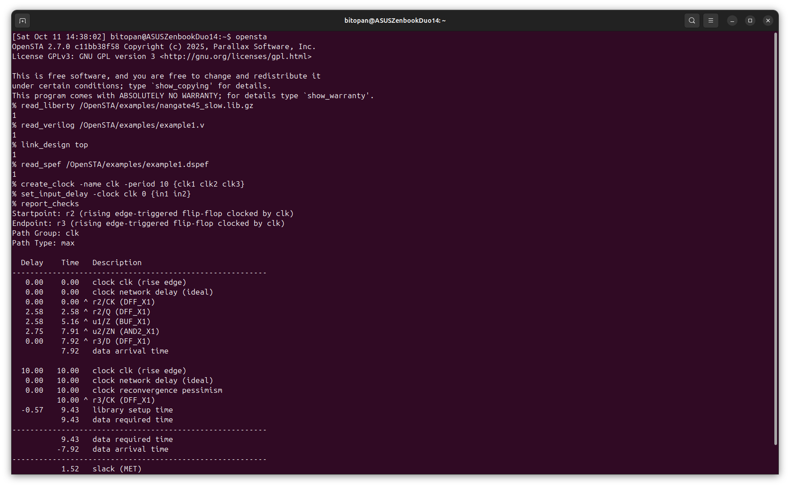
  </div>  

- **Timing Analysis Using a TCL Script**
  To streamline the timing analysis, you can place the commands in a `.tcl` script and run it directly from the OpenSTA shell. The `.tcl` script to perform timing analysis of `example1.v` is as follows:
  ```
  # min/max delay calc example
  read_liberty -max nangate45_slow.lib.gz
  read_liberty -min nangate45_fast.lib.gz
  read_verilog example1.v
  link_design top
  create_clock -name clk -period 10 {clk1 clk2 clk3}
  set_input_delay -clock clk 0 {in1 in2}
  report_checks -path_delay min_max
  ```

  Then save it with the name `min_max_delays.tcl` in an arbitrary folder.<br>
  To run the script, first move to the directory where you saved the script, and then initiate OpenSTA. And inside OpenSTA, run:
  ```
  source min_max_delays.tcl
  ```

  Alternatively, if you are in a different directory, you can also give the path to the `.tcl` file.

---

## 4. Static Timing Analysis of VSDBabySoC.

### <ins>1. Preparation of the Environment</ins>
To initiate static timing analysis on the VSDBabySoC design, it is necessary to arrange and prepare all required files within their designated directories.
```
# Create a directory to store Liberty timing libraries
/VLSI/VSDBabySoC/OpenSTA$ mkdir -p examples/timing_libs/
/VLSI/VSDBabySoC/OpenSTA/examples$ ls timing_libs/
avsddac.lib  avsdpll.lib  sky130_fd_sc_hd__tt_025C_1v80.lib

# Create a directory to store synthesized netlist and constraint files
/VLSI/VSDBabySoC/OpenSTA$ mkdir -p examples/BabySoC
/VLSI/VSDBabySoC/OpenSTA/examples$ ls BabySoC/
gcd_sky130hd.sdc  vsdbabysoc_synthesis.sdc  vsdbabysoc.synth.v
```

The necessary files are as follows:
- Standard cell library: `sky130_fd_sc_hd__tt_025C_1v80.lib`
- IP-specific Liberty libraries: `avsdpll.lib`, `avsddac.lib`
- Synthesized gate-level netlist: `vsdbabysoc.synth.v`
- Timing constraints: `vsdbabysoc_synthesis.sdc`

### <ins>2. Automate the Timing Analysis</ins>
The following TCL script executes a comprehensive minimum and maximum timing analysis on the SoC:
```
# Load Liberty Libraries (standard cell + IPs)
read_liberty -min /home/bitopan/VSD_Tapeout_Program/VSDBabySoC/OpenSTA/examples/timing_libs/sky130_fd_sc_hd__tt_025C_1v80.lib
read_liberty -max /home/bitopan/VSD_Tapeout_Program/VSDBabySoC/OpenSTA/examples/timing_libs/sky130_fd_sc_hd__tt_025C_1v80.lib

read_liberty -min /home/bitopan/VSD_Tapeout_Program/VSDBabySoC/OpenSTA/examples/timing_libs/avsdpll.lib
read_liberty -max /home/bitopan/VSD_Tapeout_Program/VSDBabySoC/OpenSTA/examples/timing_libs/avsdpll.lib

read_liberty -min /home/bitopan/VSD_Tapeout_Program/VSDBabySoC/OpenSTA/examples/timing_libs/avsddac.lib
read_liberty -max /home/bitopan/VSD_Tapeout_Program/VSDBabySoC/OpenSTA/examples/timing_libs/avsddac.lib

# Read Synthesized Netlist
read_verilog /home/bitopan/VSD_Tapeout_Program/VSDBabySoC/OpenSTA/examples/BabySoC/vsdbabysoc.synth.v

# Link the Top-Level Design
link_design vsdbabysoc

# Apply SDC Constraints
read_sdc /home/bitopan/VSD_Tapeout_Program/VSDBabySoC/OpenSTA/examples/BabySoC/vsdbabysoc_synthesis.sdc

# Generate Timing Report
report_checks

# Save timing checks to file
report_checks > /home/bitopan/VSD_Tapeout_Program/VSDBabySoC/OpenSTA/examples/BabySoC/STA_OUTPUT/sta_report.txt
```

Run the `.tcl` file inside OpenSTA:
```
source vsdbabysoc_min_max_delays.tcl
```

>[!CAUTION]
> 1. Kindly ensure that the file paths are updated to correspond with your system configuration.
> 2. Upon completion, the timing analysis report was exported, as indicated by the final command in the `.tcl` file above. The report may be reviewed [here.](VSDBabySoC_sta_report.txt)
> 3. Provide the full path of the `.tcl` file inside OpenSTA, if you're not in the same directory.

### <ins>3. ⚠️ Potential Error Notification</ins>
The following error may arise during the execution of the above `.tcl` script:
<div align="center">
   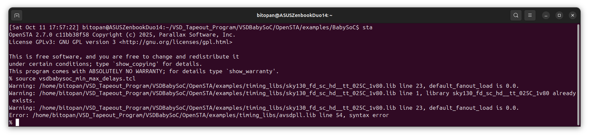
</div>

This error arises because the Liberty syntax does not recognize `//` as a valid delimiter for single-line comments. Furthermore, the presence of the `{` character immediately following `//` causes the Liberty parser to malfunction. Please examine  `avsdpll.lib` and correct any syntax issues, including but not limited to:
```
//pin (GND#2) {
//  direction : input;
//  max_transition : 2.5;
//  capacitance : 0.001;
//}
```

The above snippet will be replaced by:
```
/*
pin (GND#2) {
  direction : input;
  max_transition : 2.5;
  capacitance : 0.001;
}
*/
```

This modification should enable OpenSTA to successfully parse the Liberty file without encountering syntax errors, as follows:
<div align="center">
   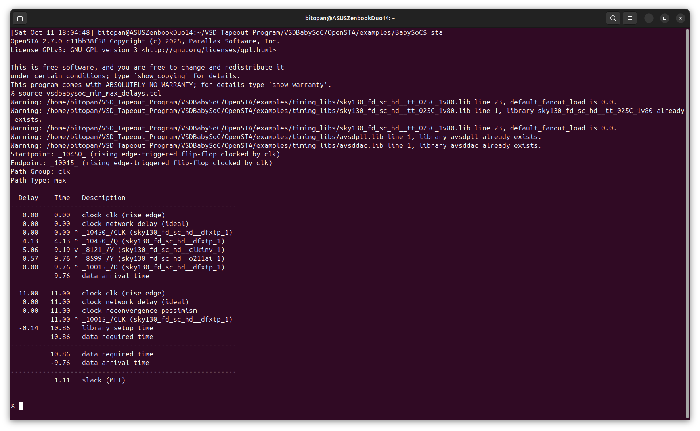
</div>

### <ins>4. Timing Diagram</ins>
This section documents the steps taken to generate timing graphs for the VSDBabySoC SoC after performing static timing analysis (STA) using OpenSTA.
- **Environment Setup**<br>
  The analysis was performed inside a Python virtual environment named venv_sta to ensure dependencies are isolated and reproducible.
  ```
  source venv_sta/bin/activate
  ```

- **Installing Graphviz**<br>
  Graphviz was required to generate visual representations of the STA results. Installation was performed in two steps:
  1. System-level installation (via apt):
  ```
  sudo apt update
  sudo apt install -y graphviz
  ```
  2. Python package installation (via pip):
  ```
  pip install graphviz
  ```

- **Preparing the Timing Graph Script**<br>
  A Python script named `timing_graph.py` was created to parse OpenSTA STA results and generate timing diagrams. The script was edited and saved in the STA output directory:
  ```
  gedit timing_graph.py
  ```
  * The script reads STA output (e.g., critical path information, arrival times, slacks).
  * Generates visual timing diagrams, showing the start and end flip-flops along with path slacks.
  * Outputs the diagram as a PNG file.
  * The python file can be accessed [here.](VSDBabySoC_timing_graph.py)

- **Executing the Timing Graph Script**<br>
  Once the script was prepared, it was executed from the virtual environment:
  ```
  python3 timing_graph.py
  ```

- The terminal log will look like this:
  <div align="center">
   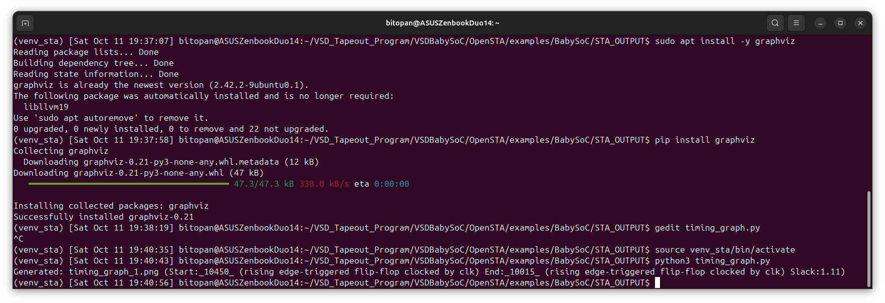
  </div>

- The generated timing diagram currently possesses excessively large dimensions and, as such, has not been embedded here. However, the image may be viewed [here](Images/timing_graph_1.png) for those who are interested. In the meantime, a new diagram with more appropriate dimensions will be generated and subsequently embedded in the future.

- **Brief Analysis from the Timing Diagram**<br>
  Static timing analysis of the critical path between FF `Start_10450` and FF `End_10015` (`sky130_fd_sc_hd cells`) reports a DataArrival of `9.760 ns`, DataRequired of `10.860 ns`, and `+1.110 ns` slack, indicating the path currently meets setup timing. The dominant delay contributions are from `dxtp_1` (`~4.13 ns`) and `clkinv_1` (`~5.06 ns`). This margin is modest; full PVT corner and hold analyses, post-route extraction, and clock-uncertainty checks are recommended before sign-off. Consider gate upsizing, logic restructuring, or pipelining if margin tightens.

---

## 🏁 Final Remarks
Week 3 focused on advancing from functional modeling to post-synthesis verification and timing validation of VSDBabySoC. The primary objectives were to ensure the synthesized netlist preserved RTL functionality and met timing constraints.<br>
Key takeaways include:
- **Gate-Level Simulation (GLS)**: Verified that the synthesized netlist produces outputs identical to RTL, confirming functional correctness after synthesis, cell mapping, and optimization. Signal transitions and timing behavior were observed using GTKWave.
- **Static Timing Analysis (STA)**: Learned setup and hold analysis, slack calculation, timing paths, flip-flop timing, clock skew, and jitter. Both graph-based and path-based approaches were explored, emphasizing critical path identification and timing verification.
- **OpenSTA Workflow**: Installed and configured OpenSTA, performed timing analysis on example designs, and applied the methodology to VSDBabySoC, incorporating SPEF-based parasitics for accurate delay estimation.
- **Timing Graphs**: Generated visual timing diagrams to illustrate critical paths and slack values. While the initial diagrams were oversized, a refined version will be embedded in the future. Analysis confirmed that the critical path meets setup timing, with additional PVT, hold, and post-route checks recommended for sign-off.

This week highlighted that SoC design extends beyond logic correctness: functional verification, timing validation, and careful analysis of critical paths are essential to ensure a robust, synthesis-ready design. Week 3 thus bridges functional modeling with the practical realities of timing-aware post-synthesis verification.


>[!IMPORTANT]
> For easy navigation to all the weeks of the program, please visit the [Master Repository](https://github.com/BitopanBaishya/VSD-Tapeout-Program-2025.git).


